# Customer-tomcat-legacy application

## Goals
In this example, you will learn the insights on what changes are required to containerize a Java application running on tomcat server. This example uses Konveyor operator to perform analysis on the application source code, the results of which produces insights needed to containerize the app.

## Prerequisites 
* Minikube
* Podman
* Konveyor Operator

## Konveyor Operator Installation 
To install Konveyor operator in your minikube cluster, follow along these set of [instructions](https://konveyor.github.io/konveyor/installation/)

_NOTE If you are using macOS, please follow along [this guide](https://github.com/konveyor/tackle2-operator/blob/main/docs/installation-macos.md) for Konveyor operator installation._
_To install `Konveyor` latest, please use the manifest from `https://raw.githubusercontent.com/konveyor/tackle2-operator/main/tackle-k8s.yaml`._

## Get started with Analysis

1. Create an app entry called `customer-tomcat` in the `Analysis` tab of the tackle ui. 
    * Fill in the name of the application
    * Expand source code and enter the following
        * Repository Type: Git
        * Source Repository: https://github.com/konveyor/example-applications.git
        * Branch: main
        * Root path: /example-1/
        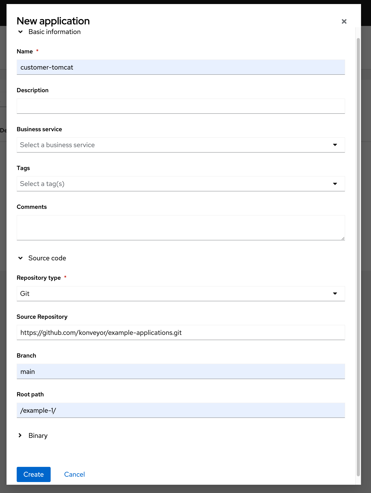

    * Click on the `Create`  button.

2. Select the `customer-tomcat` app and click on the `Analyze` button.
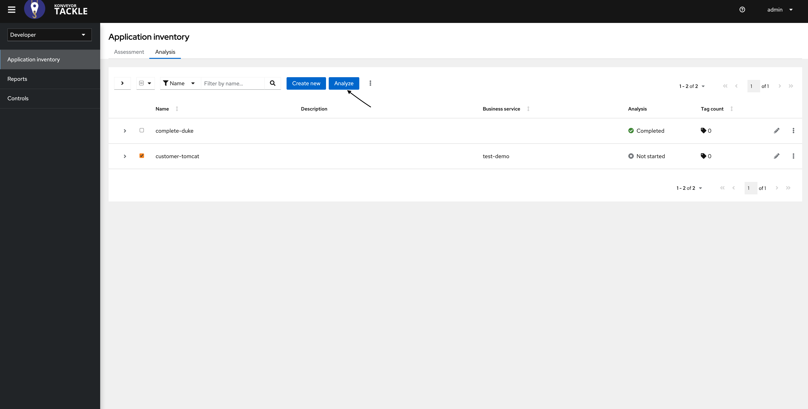

    * An application analysis wizard will open. 
        * Select `Source Code + dependencies` in the dropdown and click `Next` button
        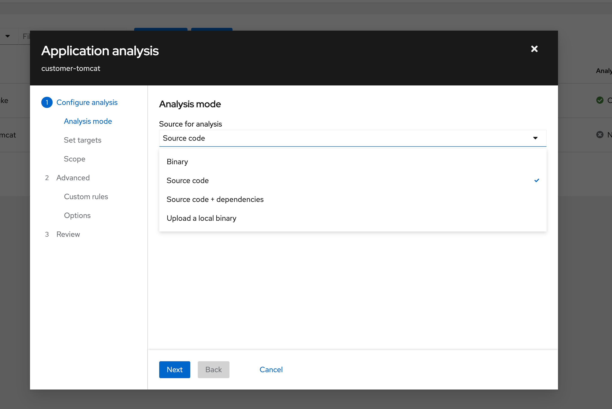

        * In the `Set Targets` pane, select `Containerization` option and click `Next`
        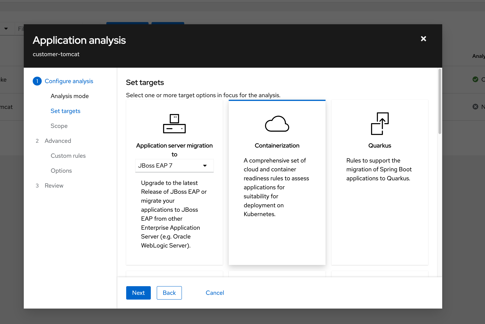

        * For scope, select `Application and internal dependencies only` 
        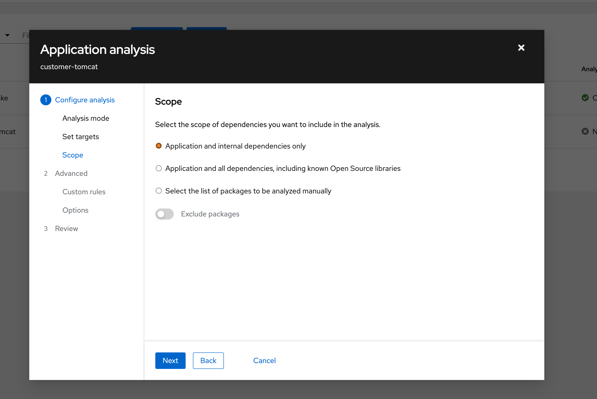

        * Keep the defaults in Advanced section
        * Move to the `Review` pane, and click on `Run` button
        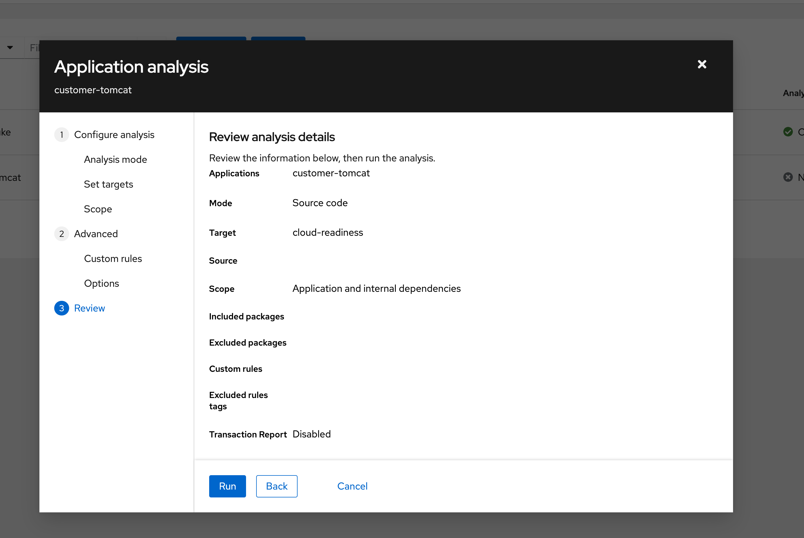

3. You will notice that the status of the app has been updated to `In Progess`. Wait until it changes to `Completed`.
    a.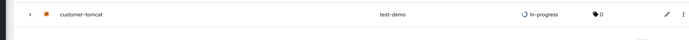
    b. 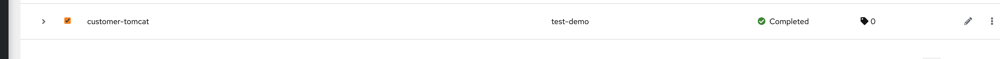

4. Click on the app, and a pop-up pane will appear on the right side of the window with three tabs.
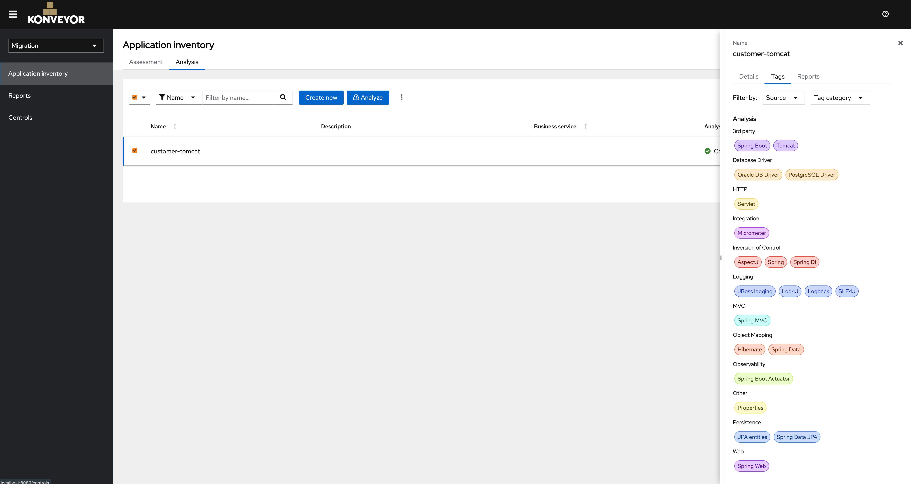
In the `Tags` tab, you can see the tags organized by categories that are applicable to this application.

Click on the `Reports` tab, and select the `Report` hyperlink.
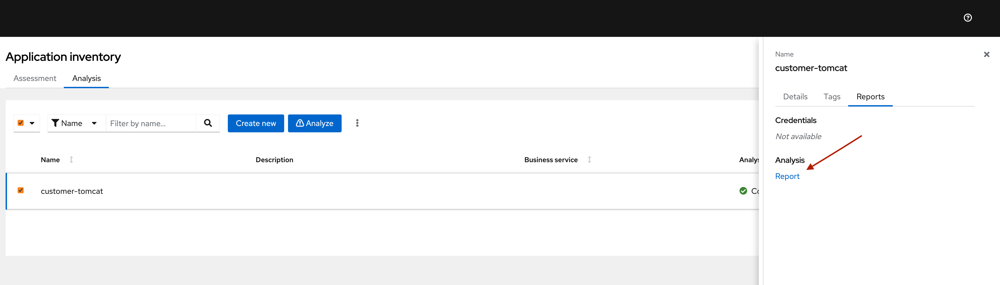

5. Konveyor Analysis dashboard gets opened in a new tab.
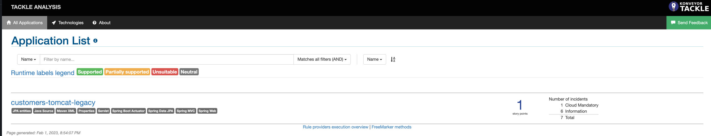
Since we selected `Source code + Dependencies` in the Analysis wizard, in addition to the example-1 app report, we also have a report for the dependencies. 

6. Click on the `All Issues` tab in the top navigation bar.
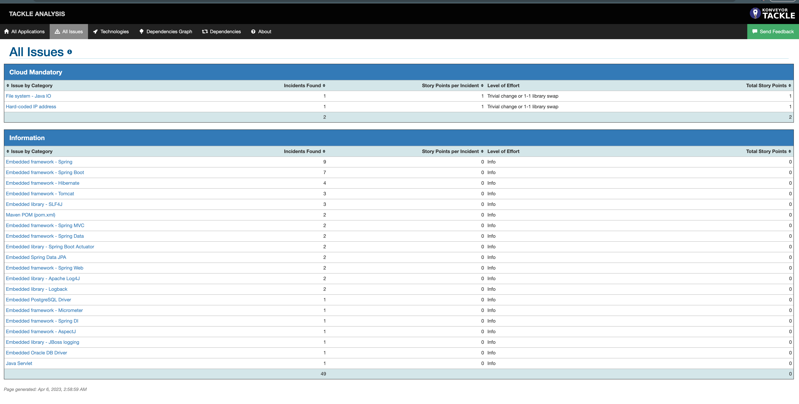
Here you can see a list of informational issues and a couple of issues in the cloud mandatory column along with story point estimates. 
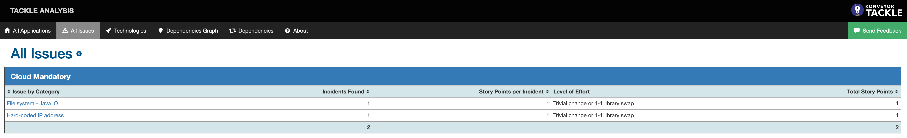
Click on the issues to expand them. This view provides detailed information regarding File system - Java IO and Hard-coded IP address respectively.
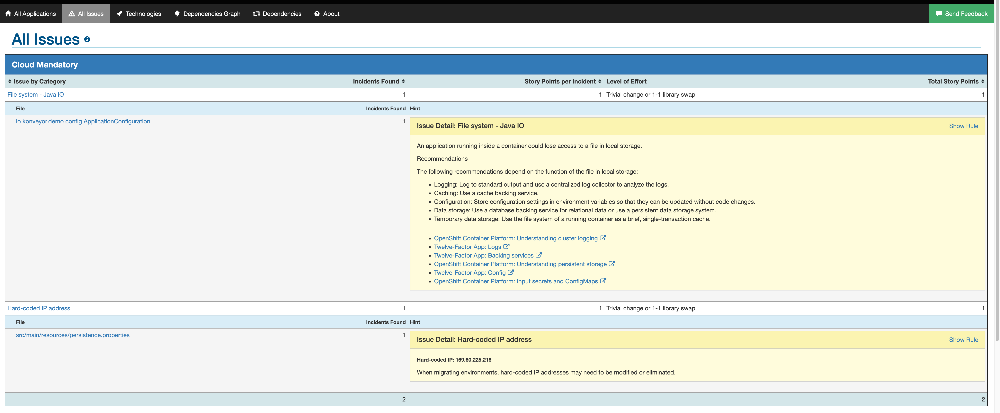

7. Let’s look into each of the issues
   * File system - Java IO: This issue flags that the app is reading from a file location.This creates awareness, so that the migrator/architect is aware of data access and its dependencies. Click on the hyperlink highlighted below,
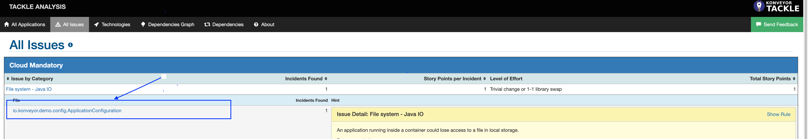
It will navigate to a page which provides finer details on the location of the identified issue itself.
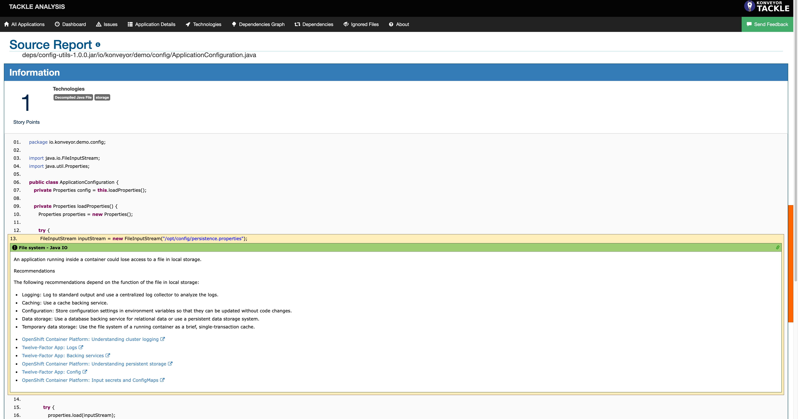
   * Hard-coded IP address: To run an app in Kubernetes, it needs to be portable and highly configurable. The application should not have hardcoded values and provide mechanisms to pass the required arguments through a config object or via environmental variables. In this example, we have identified that the app uses a 
hardcoded IP address and it needs to be changed to make it cloud ready. 
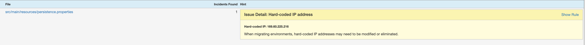
If you click on the file, it will show you the exact location of the line with the hard coded static IP address.
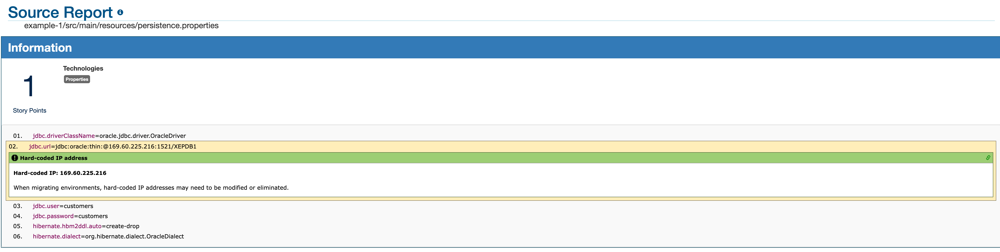
Using the above information, the migrator/architect can estimate the amount of effort needed to modernize the application and also have an idea of what changes are needed to be cloud ready. 

We have successfuly ran `Analysis` on the Java legacy application and found issues that need to be fixed to make this app cloud ready.  

