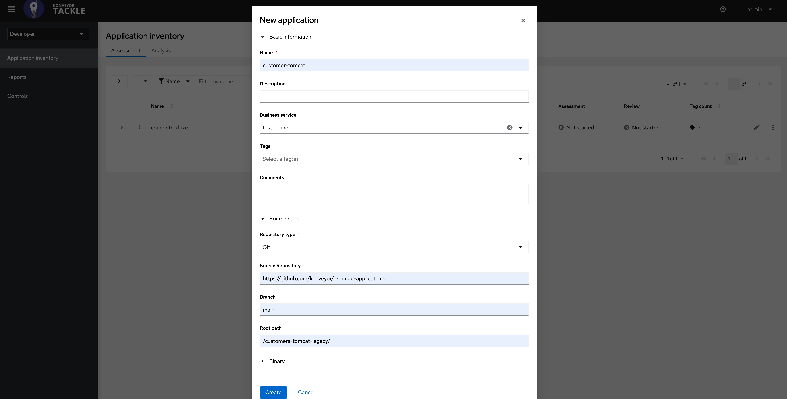
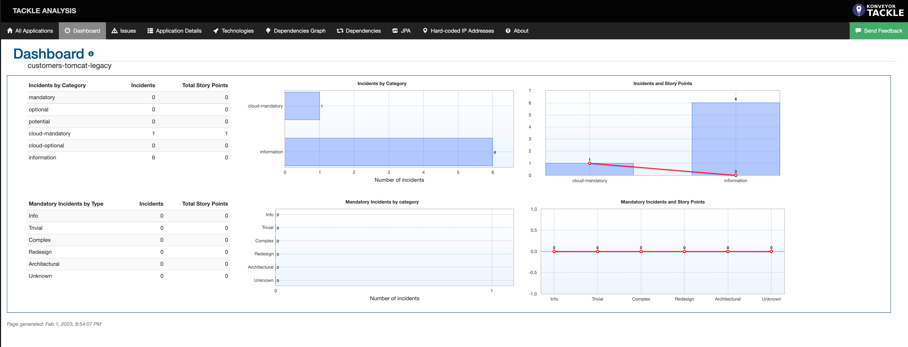
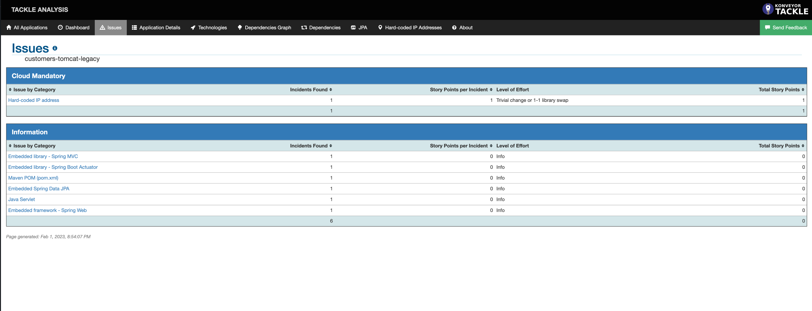

# Customer-tomcat-legacy application

## Goals
In this example, you will learn the insights on what changes are required to containerize a Java application running on tomcat server. This example uses Konveyor operator to perform analysis on the application source code, the results of which produces insights needed to containerize the app.

## Prerequisites 
* Minikube
* Podman
* Konveyor Operator

## Konveyor Operator Installation 
To install Konveyor operator in your minikube cluster, follow along these set of [instructions](https://github.com/konveyor/tackle2-operator#tackle-operator-installation-on-k8s)

_NOTE If you are using macOS, please follow along [this guide](https://github.com/konveyor/tackle2-operator/blob/main/docs/installation-macos.md) for Konveyor operator installation._

## Get started with Analysis

1. Create an app entry called `customer-tomcat` in the `Analysis` tab of the tackle ui. 
    * Fill in the name of the application
    * Expand source code and enter the following
        * Repository Type: Git
        * Source Repository: https://github.com/konveyor/example-applications
        * Branch: main
        * Root path: /customers-tomcat-legacy/
        

    * Click on the `Create`  button.

2. Select the `customer-tomcat` app and click on the `Analyze` button.

    * An application analysis wizard will open. 
        * Select `Source Code` in the dropdown and click `Next` button
        

        * In the `Set Targets` pane, select `Containerization` option and click `Next`
        

        * For scope, select `Application and internal dependencies only` 
        

        * Keep the defaults in Advanced section
        * Move to the `Review` pane, and click on `Run` button
        

3. You will notice that the status of the app has been updated to `In Progess`. Wait until it changes to `Completed`.
    a.
    b. 

4. Expand the app, and click on the Analysis `Report` hyperlink

5. Konveyor Analysis dashboard gets opened in a new tab.

6. Click on the `cutsomers-tomcat-legacy` hyperlink and it will navigate to a dashboard.

7. Naviagte to issues, and you can see a bunch of warnings and mandatory columns along with story point estimates. In this example, we have identified that the app uses hardcoded IP and it needs to changed to make it cloud ready. 

We have successfuly ran `Analysis` on the Java legacy application and found issues that need to be fixed to make this app cloud ready.  

